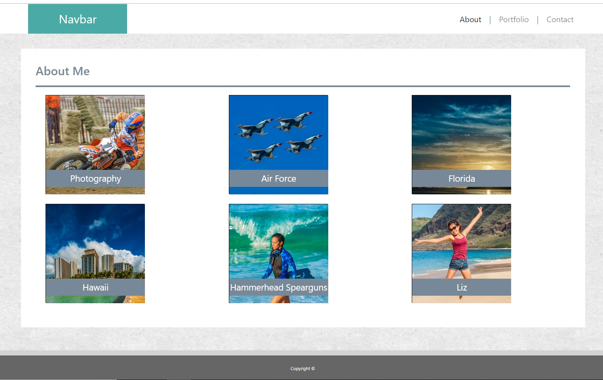
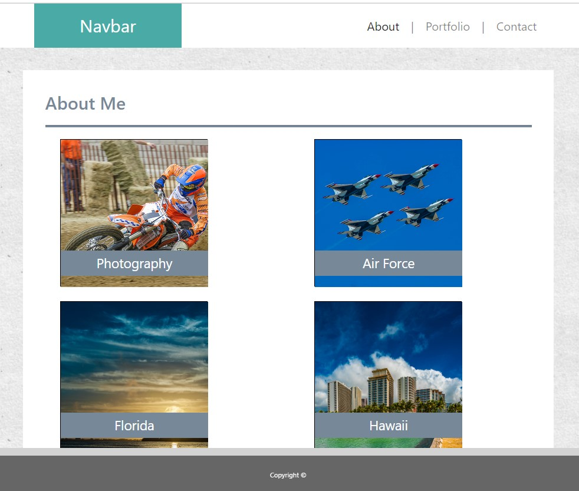

# 02_Responsive_Portfolio

### Table of Contents
- [Description](#Description)
- [Technologies-Libraries](#Technologies-Libraries)
- [Screenshots](#Screenshots)
- [Link](#Link)
​
### Description
This project is duplicating the previous homework using Bootstrap.

I started with a fresh index and css file and added Nav from Bootstrap.

I then copied the body section of the previous homework. Day 2 we learned about containers, rows and columns so I switched the body section to the same.

From there, the portfolio was the most complex so I work on that bag adding the Bootstrap column system.

Contact page was the same, however much more simple.

Yes, the images used on the portfolio page are mine, I took them.
​
### Technologies-Libraries
- [Bootstrap](https://getbootstrap.com/) - CSS Framework
​
### Screenshots
​

​

​
### Link
Check it out! 
https://chrisneal72.github.io/02_Responsive_Portfolio/